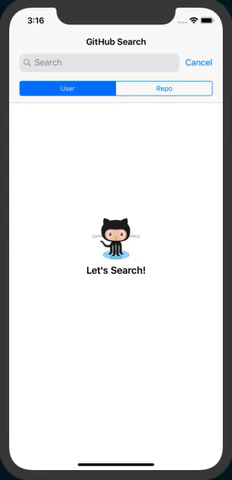

# GitHubSearch

GitHubSearch is an example for ReactComponentKit. It searches github's users or repositories. 

## Before Build

You should set yours client_id and client_secret from GitHub.com. You can get it from [here.](https://github.com/settings/developers) 

If you get the above values, you should set them at GitHubAPIKey.swift.

```swift
import Foundation

enum GitHubAPIKey {
    static let client_id = "<WRITE HERE YOUR CLIENT_ID>"
    static let client_secret = "<WRITE HERE YOUR CLIENT_SECRET>"
}
```

## Build and Run it!

You might see the below screens :)



## Completed

- [x] Search Users
- [x] Search Repositories
- [x] Show Loding Component when app is requesting an api.
- [x] Show Error Component when the app has occurred some error.
- [x] Show Empty Component when the search result is empty.

## The MIT License 

MIT License

Copyright (c) 2018 Sungcheol Kim, https://github.com/ReactComponentKit/GitHubSearch

Permission is hereby granted, free of charge, to any person obtaining a copy
of this software and associated documentation files (the "Software"), to deal
in the Software without restriction, including without limitation the rights
to use, copy, modify, merge, publish, distribute, sublicense, and/or sell
copies of the Software, and to permit persons to whom the Software is
furnished to do so, subject to the following conditions:

The above copyright notice and this permission notice shall be included in all
copies or substantial portions of the Software.

THE SOFTWARE IS PROVIDED "AS IS", WITHOUT WARRANTY OF ANY KIND, EXPRESS OR
IMPLIED, INCLUDING BUT NOT LIMITED TO THE WARRANTIES OF MERCHANTABILITY,
FITNESS FOR A PARTICULAR PURPOSE AND NONINFRINGEMENT. IN NO EVENT SHALL THE
AUTHORS OR COPYRIGHT HOLDERS BE LIABLE FOR ANY CLAIM, DAMAGES OR OTHER
LIABILITY, WHETHER IN AN ACTION OF CONTRACT, TORT OR OTHERWISE, ARISING FROM,
OUT OF OR IN CONNECTION WITH THE SOFTWARE OR THE USE OR OTHER DEALINGS IN THE
SOFTWARE.